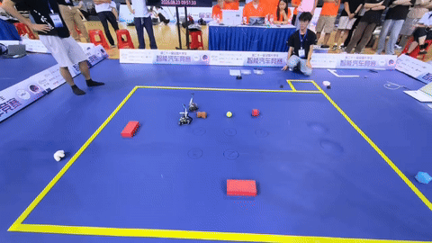
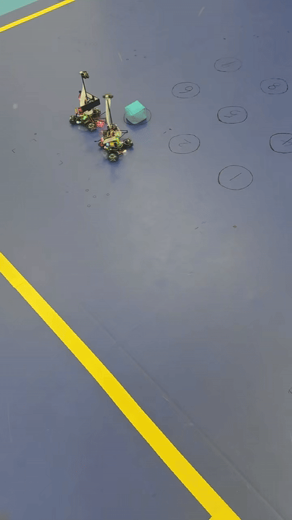
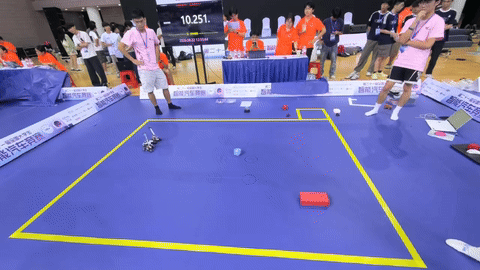
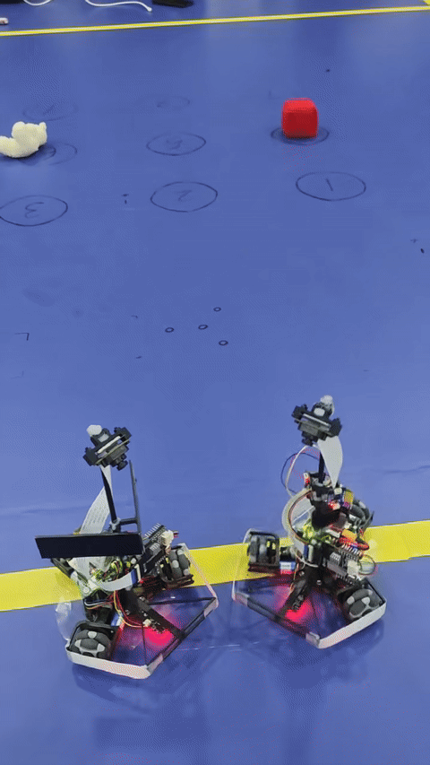
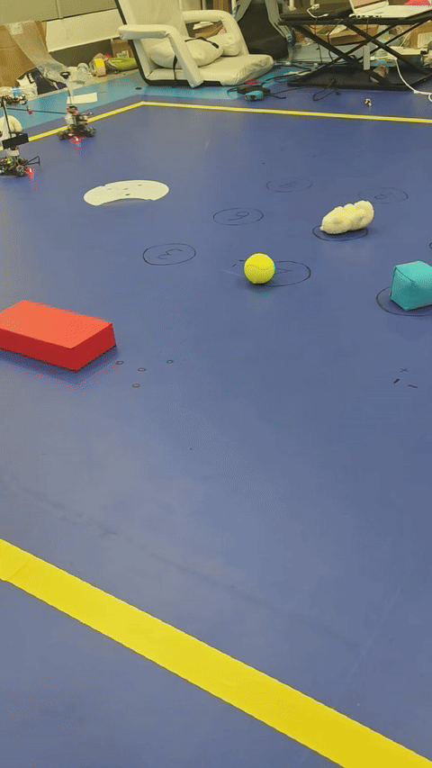
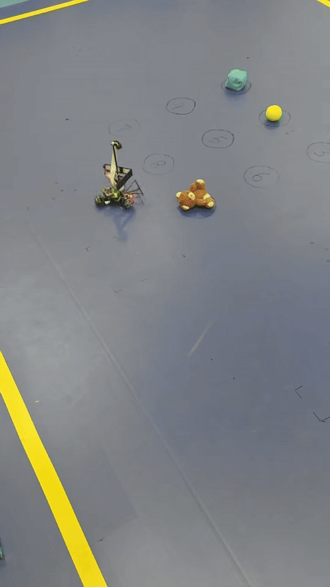

# Ant House Moving

第 21 届全国大学生智能车竞赛缩微组“蚂蚁搬家”相关代码。

by 21st 南工绝影一队

## 1.1.1 团队介绍
| 姓名 | 职责 | 学院 | 获奖情况 |
| --- | --- | --- | --- |
| 王雨田 | 队长/硬件 | 哈尔滨工业大学（深圳）计算机科学与技术学院 | 第二十一届全国大学生智能车竞赛全国总决赛蚂蚁搬家组冠军、第二十一届全国大学生智能车竞赛华南赛区一等奖、2026“嘉立创杯”个人焊接赛二等奖 |
| 黎航宇 | 软件 | 哈尔滨工业大学（深圳）计算机科学与技术学院 | 第二十一届全国大学生智能车竞赛全国总决赛蚂蚁搬家组冠军、第二十一届全国大学生智能车竞赛华南赛区一等奖 |
| 王宣翔 | 软件 | 哈尔滨工业大学（深圳）计算机科学与技术学院 | 第二十一届全国大学生智能车竞赛全国总决赛蚂蚁搬家组冠军、第二十一届全国大学生智能车竞赛华南赛区一等奖 |
| 陈书安 | 视觉 | 哈尔滨工业大学（深圳）计算机科学与技术学院 | 第二十一届全国大学生智能车竞赛全国总决赛蚂蚁搬家组冠军、第二十一届全国大学生智能车竞赛华南赛区一等奖 |

ps小精灵：codex，claude code

本代码采取全局惯性导航方案，通过三轮全向小车惯性导航，tof测距模块，yolo目标识别实现双车协同推动小球，沙袋，小熊等物体

主车5750lines 从车5280lines 共11030lines by 2026/8/19

主要硬件：
MCU：恩智浦rt1021（micropython）
IMU：逐飞科技imu660RB（意法半导体LSM6DSLTR六轴传感器）
tof：意法半导体VL53L4CD模块

## 1.1.2 主要文件

| Directory | Purpose | Main entry |
| --- | --- | --- |
| [`main_car/`](main_car/) | 主车：扫描、物体选择、路径规划、视觉伺服、协同搬运 | [`main_car/user_main.py#L231`](main_car/user_main.py#L231) |
| [`slave_car/`](slave_car/) | 从车：接收主车指令、惯导、伺服、环绕、TOF 距离控制 | [`slave_car/user_main.py#L316`](slave_car/user_main.py#L316) |
| [`openmv/`](openmv/) | OpenMV / OpenART 视觉侧程序 | [`openmv/finish_competition/main_openart.py#L149`](openmv/finish_competition/main_openart.py#L149) |
| [`assisting car/`](assisting%20car/) | 辅助车相关程序和资料 | - |（已弃用）
| [`assiting car camera/`](assiting%20car%20camera/) | 辅助车摄像头相关程序和资料 | - |（已弃用）
| [`tools/`](tools/) | 上位机、路径与障碍调试工具 | [`tools/boundary_debug_viewer.py#L362`](tools/boundary_debug_viewer.py#L362) |
| `seekfree_demo/` | 逐飞底层示例 | - |
| `stubs/` | MicroPython 类型桩文件 | - |

## Main-Car Modules

| File | Responsibility |
| --- | --- |
| [`ant_task.py#L16`](main_car/ant_task.py#L16) | 顶层任务状态机，组织扫描、选物体、导航、搬运、校准 |
| [`ant_boundary_plan.py#L4`](main_car/ant_boundary_plan.py#L4) | 九宫格物体选择、障碍膨胀、到边界的一次转向路径规划 |
| [`ant_plan.py#L25`](main_car/ant_plan.py#L25) | 惯导路径跟踪、转角控制、速度规划 |
| [`ant_else.py#L561`](main_car/ant_else.py#L561) | 蜂鸣器、主从车无线通讯的发送与解析、车与openart摄像头的通讯、txt参数读取 |
| [`ant_move.py#L21`](main_car/ant_move.py#L21) | 主从协同的 navigate / servo / orbit / move 状态机 |
| [`ant_vision.py#L12`](main_car/ant_vision.py#L12) | 控制视觉伺服，环绕与 AprilTag 校准（已弃用） |
| [`ant_motor.py#L150`](main_car/ant_motor.py#L150) | 底层编码器里程计、四元数姿态、角度环、三轮速度 PID |
| [`main_config.txt`](main_car/main_config.txt) | 主车控制、速度、视觉、规划参数 |
| [`user_main.py#L231`](main_car/user_main.py#L231) | 硬件初始化、定时器回调与主程序入口 |

## Slave-Car Modules

从车的大部分控制结构与主车对应。额外的关键文件为：

| File | Responsibility |
| --- | --- |
| [`vl53l4cd.py#L66`](slave_car/vl53l4cd.py#L66) | VL53L4CD TOF I2C 驱动 |
| [`ant_move.py#L25`](slave_car/ant_move.py#L25) | TOF 控制类与协同搬运流程 |
| [`ant_motor.py#L708`](slave_car/ant_motor.py#L708) | TOF 距离 PID（`DistPID`）及底层运动控制 |
| [`slave_config.txt`](slave_car/slave_config.txt) | 从车独立的控制参数 |

## 1.2题目要求
转自CSDN@卓晴 文章链接：https://zhuoqing.blog.csdn.net/article/details/154691441?spm=1011.2415.3001.5331

### 第21届智能车竞赛蚂蚁搬家组搬运任务说明
### 一、怎么搬？

参赛队伍制作两辆搬运车模（步兵），根据搬运的目标种类，将目标从场地中央搬运到场地四周。

除了搬运车模，还允许自行设置数量不超过2台的辅助车模（工兵）或者导引信标，分别用于目标发现、辅助路径规划、搬运位置、发车区域导航等。

用于计算成绩的车模重量只对两辆搬运车模进行称重相加，再除以2，即两辆搬运车模的平均重量，不累加辅助车模的重量。

辅助车模可以不用移动，也可以移动。高度不超过50厘米，边长尺寸不超过30厘米×30厘米。辅助车模不允许触碰搬运物品。

注：使用NXP-MicroPython作为搬运车模的控制器；使用STC单片机来制作辅助车模、引导信标的控制器。（在我们的方案中未使用辅助车模）

比赛场地是一块矩形区域，场地内外铺设有蓝色的背景布，场地边界由宽度为5厘米的黄色胶带铺设。为了便于同学同时准备“人工智能视觉”组别的比赛，兼容蚂蚁搬家和人工智能视觉组的场地。正式比赛时，这两个组别的场地尺寸都设置为3.2米×2.4米见方。

负责搬运工作的两台车模从发车区域出发，完成任务之后返回到发车区域。被搬运物品放置在场地中心一米见方的区域内，物品之间保持10厘米最小间距。

比赛成绩（时间）从车模从发车区出发到返回出发区之间的时间间隔决定。如果遗漏搬运物品，会在比赛裁判员手册中给出罚时标准。

辅助车模在比赛期间不允许参与物品的搬运，也就是不允许触碰到被搬运的物品。在比赛过程中，辅助车模没有限制出发区和停车区。

在正式比赛之前，搬运车模放置在发车区内，辅助车模放置在固定位置，然后再摆放被搬运物体，摆好之后不允许再操作车模，只允许按一次发射键，避免人为给小车输入信息。

> **图1.1.1 比赛场地示意图**

用于搬运物品的支杆，需要使用长度（即水平方向的尺寸）不超过10厘米的推杆。推杆的高度（即垂直方向的尺寸）不超过5厘米。推杆除了要求是直的（不允许带有弧度或者夹角或者其它针刺等，不允许变形）之外，它与车模的夹角并没有限制。车模制作完成之后，包括推杆在内，外形尺寸需要小于30厘米。推杆的个数只能是一个。

> **图1.1.2 车模上搬运物品推杆示意图**

下面动图演示了车模从发车区完成单个物品的搬运过程，但最终两个车模需要重新返回到发车区。搬运物品过程中不允许单个车模完成搬运。

注意：为了便于现场安装电子计时系统，车模从发车区域出发以及回到发车区域都需要从场地与发车区重叠一边出入发车区。

物品离开场地黄色边界线即算搬运成功，即使此时搬运车模还在黄色边界线之内。完成搬运之后，如果物品由于自身的原因（比如滚动、倾倒）重新回到黄色边界线，也不影响搬运成功的结果。每一次只允许搬运一件物品。

### 二、搬什么？

搬运物品包括有三种：

1. **标准网球（浅绿色）**：直径6.54至6.86厘米
    

   > **图1.2.1 标准网球**

2. **玩具沙袋（红色、蓝色）**：边长7厘米
   

   > **图1.2.2 玩具沙袋**

3. **泰迪熊（棕色、白色）**：高度小于20厘米
   

   > **图1.2.3 玩具熊**

### 三、搬到哪儿？

根据不同的赛段，搬运目标区域是不同的：

- **预赛阶段**：只需要将目标搬运到场地外即可
- **决赛阶段**：参见图1.1.1比赛场地示意图
  - 标准网球：场地上方
  - 玩具沙袋：场地左方
  - 泰迪熊：场地右方

### 四、有哪些障碍？

比赛场地内有可能存在两种障碍：

**（1）路面凸起**

场内的路面凸起是允许车模压过的圆形坡道，具体规格与竞赛中信标组的外壳一样。调试时可以使用普通的信标灯进行测试。信标灯的直径大约为25厘米，中心高度为1.5厘米。车模在运行过程中可以躲避路面凸起，也可以直接压过。比赛时，路面凸起使用与背景蓝色相同的背景布覆盖。

> **图1.4.1 场地内的凸起障碍**

凸起障碍位于搬运物品区域外面。

**（2）砖块路障**

> **图1.4.2 标准砖块尺寸**

砖块可能位于距离边界线50厘米范围内，个数小于等于3。

关于蚂蚁搬家组的障碍物砖头，要求文档里写的规格是240×151×35mm，可是现在市面上好像都是240×115×50mm，砖也有很多种类，是最简单的那种红砖吗？能确定一下吗？然后能给障碍物数量的范围吗，比如红砖障碍的个数小于等于3。

- **预赛阶段**：不存在以上两种障碍
- **决赛阶段**：存在以上两种障碍

### 相关文献链接
- 《第21届智能车竞赛飞檐走壁组比赛赛道制作说明》
- 《第21届智能车竞赛疯狂电路组比赛赛道制作说明与计分标准》
- 《第21届智能车竞赛蚂蚁搬家组搬运任务说明》
- 《第21届智能车竞赛飞跃雷区组车模与比赛场地说明》
- 《第21届智能车竞赛走马观碑组比赛场地与目标板说明》
- 《第21届智能车竞赛雁过留痕组比赛场地与紫外线感光片说明》
- 《第21届智能车竞赛人工智能视觉组比赛细则》
- 《第21届智能车竞赛人工智能完模比赛细则》
# 二、设计概述
## 2.1 项目介绍
本项目面向第21届智能车竞赛“蚂蚁搬家”赛项，由哈工大（深圳）南工绝影一队研发。采用主车决策、从车执行的双车架构，均以逐飞RT1021（MicroPython）为主控，搭载OpenART视觉模块。软件基于协作式定时器调度，融合**Mahony四元数姿态解算**与三轮全向里程计实现高精度定位，硬件上使用**负压**来解决三轮全向轮的打滑缺陷；全局路径采用可视图法结合**Dijkstra规划**，**S曲线速度平滑**过弯。视觉端以**YOLO模型**实时识别目标，结合视觉伺服精准贴近，并利用AprilTag在线校准里程计。整车在320cm×240cm场地内自主完成目标识别、环绕贴近及推送出界，实现高效稳定的搬运作业，可以用于物流搬运等需要协同搬运的场景。
# 三、核心设计
## 3.1 总体设计框图

## 3.2 硬件电路组成
### 3.2.1 主驱一体板
#### 3.2.1.1 电源树
电源模块作为系统的“能量枢纽”，负责为所有子模块提供稳定电能。其设计除需精确设定电压范围与输出电流等基础参数外，还须从转换效率、噪声抑制、抗干扰能力及电路拓扑简洁性等多维度进行综合优化。可靠、高效的电源方案，是保障整车硬件电路稳定运行的核心基础。
全部硬件电路的电源由格式3s电池提供（额定电压11.1V，满电电压12.6V）。由于电路中的不同电路模块所需要的工作电压和电流容量各不相同，电源模块应该包含多个稳压电路，将充电电池电压转换成各个模块所需要的电压。为满足需要，本车模上存在3种供电电压：
(1) DRV8701有刷全桥驱动使用3s锂电池供电，正常使用时电压在11.8-12.6V，可直接用于给驱动供电。
(2) 使用降压电源芯片TPS54302DDCR搭建12V-5V降压电路，输出电压5V，用于给各个线性稳压器，串口，核心板，ToF模块以及OpenArt plus供电。原理图如图3.1所示。

> 图3.1 降压电路12V-5V原理图
> 图中C35、C36、C46为输入滤波电容；L1为Buck拓扑中的功率电感；C18、C38、C39为输出滤波电容。D6为SS54肖特基二极管，其作用是在VCCBAT输入掉电时，防止VCC5V端电压经芯片内部路径反向灌入Buck芯片，避免造成器件损坏。R39与R40构成反馈电阻分压网络，用于设定输出电压；C9为前馈电容，与R39并联，用于提升负载瞬态响应性能，加快输出电压的恢复速度。

(3) 使用线性稳压器RT9013-33 将5V输入降为3.3V输出，用于编码器，调试器、蜂鸣器、imu，按键等供电。
 
> 图3.2 降压电路5V-3.3V原理图
> 图中CR为时序引脚，核心板上电完成后才会被拉高，防止外设先于核心板上电。

(4) 使用电子开关SY6280AAC控制5V外设上电，用于OpenArt plus，光电管，无线串口等供电。

> 图3.3 5V外设上电时序控制电路
> 图中CR为时序引脚，核心板上电完成后才会被拉高，防止外设先于核心板上电。

#### 3.2.1.2 DRV8701有刷驱动电路
DRV8701是一款采用4个外部N通道MOSFET的单路H桥栅极驱动器，主要用于驱动12V至24V双向有刷直流电机。该器件可通过PH/EN(DRV8701E)轻松连接控制器电路。

> 图3.4 DRV8701有刷驱动
> U15为肖特基二极管（型号1N5819W），串接于电源输入端，用于实现反接保护，防止电源极性接反时损坏驱动芯片。C54与C44为输入电源滤波电容，用于抑制电源噪声并稳定输入电压。C49与C51为电荷泵外接电容，用于产生高侧MOSFET驱动所需的栅极电压，确保上桥臂正常导通。
### 3.2.2 无刷电调
> 注：本电调电路设计参考逐飞开源AI8051U电调

我们使用了负压风扇来增强车模稳定性，其中风扇需要使用无刷电机，无刷电机的驱动需要无刷电调，因此我们参考逐飞科技开源的AI8051U无刷电调，制作了一款适合高kV值无刷电机的电调。具体设计如下：
(1)总控制MCU采用AI8051U-34K64-QFN48（U3），负责生成六路互补PWM信号（PWMA_CH1P/N、CH2P/N、CH3P/N），经栅极驱动芯片FD6288Q（U2）后，驱动由六颗N沟道功率MOSFET（TPN2R703NL，Q1-Q6）组成的三相全桥电路。驱动芯片内置死区时间控制与电平转换功能，确保高压侧（VSA/VSB/VSC）与低压侧驱动信号匹配，满足高kV值无刷电机的高速换相需求。

（2）电源管理方面，电池电压VBAT经防反接二极管D1（DSK34）后接入主功率回路，同时经由同步降压转换器U1（SE8650X2-HF）降压至5 V（VCC5V），为MCU、驱动芯片低压侧及指示电路供电。15 V稳压管D2（BZT52C15）配合外围电路生成高压侧驱动电源（$1N23网络），并经D3-D5（B5819WS）分别供给三相上桥臂，确保高侧MOSFET可靠导通。

（3）三相逆变输出分别连接至VSA、VSB、VSC节点，并通过三组分压网络（ABMF：R14/R15/R16；BBMF：R17/R18/R19；CBMF：R20/R21/R22）将相电压信号反馈至MCU的ADC引脚（U3.32、U3.24、U3.25），用于反电动势检测与无感换相控制。此外，电池电压经R10/R11分压后接入BATADC引脚（U3.2）实现电压监测，PWMIN信号（H1.2/R8.1）用于外部PWM调速输入。

（4）板载指示电路包括运行状态指示灯LED4（RUN）与错误指示灯LED3（ERR），分别由MCU的U3.13与U3.14引脚控制。调试接口P1提供串口通信（DBRX/DBTX），便于烧录、参数整定与实时数据监控。整体电路采用紧凑化布局，关键去耦电容（C21~C35）就近布置于各电源引脚，以抑制开关噪声，提升系统抗干扰能力。

### 3.2.3 光电管
光电传感器基于反射式光强检测原理，用于区分赛道背景与路肩的颜色差异，进而实现出界触发与惯性导航的定点矫正。系统采用主动发射-被动接收的反射型光电架构：发射管 U1（型号 NTD3528R2，中心波长 660 nm）向外辐射近红外光，光束经被测地面反射后，由接收管 D1（3528 封装硅光电管）捕获。该 660 nm 波段对红、蓝等常见赛道色具有显著反射率差异，便于后续阈值判别。

在信号调理电路方面，D1 与串联电阻 R17 构成反向偏置分压网络，其中 D1 接于电源侧，R17 接地侧，节点 V1 位于二者公共连接处。当无光照或反射光弱时，D1 反向电流极小，等效电阻很大，V1 点电压因 R17 下拉作用而处于较低电位；随着反射光功率增强，D1 光生载流子增多，反向等效电阻降低，使 V1 点电位升高。该电压变化幅度直接反映地面材质的反射特性——反射越强，V1 电压越高。通过比较器将V1 电压值与阈值电压比较，即可实时判断车模是否越界。该方案简洁高效，不依赖复杂光学透镜，且响应速度满足运动状态下的实时检测需求。

> 图3.5 光电管核心电路
### 3.2.4 LED灯板
为增强视觉模型在较暗环境下的鲁棒性，我们增加了两盏LED灯作为辅助光源（即辅助“车”）

LED灯珠采用GW JTLMS1.CM-G9H4-XX53-1，色温5000K，显色指数高达90，适合作为视觉补光灯。LED使用SY7200AABC芯片驱动，SY7200A是一款DC/DC升压转换器，可提供精确的恒定电流以驱动LED。其工作在1MHz的固定开关频率，允许使用小值外部陶瓷电容和电感。通过外部电阻设置调节电流，驱动串联连接的LED。该器件理想用于驱动最多八个串联的白光LED或高达30V的电压。外围电路如图3.8，R3为反馈电阻，可以反馈当前电流，计算公式为：

$R_1 = 0.2 / I_{\text{LED}}$

GW JTLMS1.CM-G9H4-XX53-1的最大前向电流为150mA，考虑裕量带入I_LED=120mA，即设定PWM为满占空比时为120mA。

> 图3.6 LED驱动电路
## 3.3 项目功能与参数
### 3.3.1项目功能
本项目面向第二十一届全国大学生智能汽车竞赛“蚂蚁搬家”赛项，设计并实现了一款基于RT1021单片机与OpenMV视觉模块的双车协同搬运全向轮车模系统。系统采用主车决策、从车执行的双车架构，主车通过OpenMV采集图像，利用YOLO模型实时识别待搬运物体的类别及其像素坐标，并经由坐标映射转换为场地全局位置，从而获取目标的种类与空间分布；从车接收主车指令，配合全向轮底盘实现灵活移动。系统融合全局路径规划与底层运动控制算法，根据识别结果动态计算搬运顺序及行进路线，自主完成目标接近、拾取（环绕贴近）、运输及至对应目标区域推送出界的完整作业流程。该方案有效实现了视觉感知、协同决策与精准运动的闭环，具备较高的定位精度与系统稳定性。
### 3.3.2项目参数
经实车测试，本设计车模的主要性能指标如下：最高稳定运行速度可达1.2 m/s，满足赛项对快速搬运的要求；基于里程计与视觉辅助融合定位的全局坐标定位精度优于±5 cm，确保精确到达目标点及推送区域；车模底部负压装置可提供约1000 gf（约9.8 N）的垂直下压力，有效增大轮胎与地面的附着系数，显著抑制高速转向时的侧滑与漂移，提升运动稳定性；单辆车模整机功耗约为27.8 W，双车协同工作时总功耗约55.6 W。
## 3.4程序设计流程图

> 项目源代码位于(https://github.com/wangxuanxiang/21st_SmartCar_mybj_OpenSource)
### 3.4.1 软件系统总体架构

本系统软件采用"主车决策—从车执行—视觉感知"的三层分布式架构，主车与从车均以逐飞RT1021核心板（MicroPython）为主控，各搭载一块OpenART mini视觉模块，三者之间通过串口与无线串口模块实时通信。

主车是全局决策者，负责全场定位、全局路径规划、目标扫描与评分选择、视觉伺服靠近、绕物体环绕以及将物体推送至场地边界，并通过无线串口指挥从车与辅助车协同作业；从车是执行者，接收主车下发的路径与目标点后独立完成导航、视觉伺服以及基于TOF测距（VL53L4CD）的贴靠距离控制，并通过AprilTag完成里程计校准；视觉层负责色块与模型目标识别及AprilTag姿态解算，识别结果经串口回传主控。

主车软件未使用操作系统，而是采用协作式定时器调度：4ms定时器负责传感器数据更新、姿态解算、动态PID参数整定与三轮运动学解算输出；10ms定时器负责角度环PID计算与任务状态机运行；53ms定时器负责启动按键扫描、主从车握手通信与无线串口调试信息输出。通过合理划分中断周期，保证了控制回路的实时性与决策逻辑的响应速度。

比赛模式下，任务状态机共包含就绪导航、导航、扫描、伺服、环绕、搬运、校准、调整、回库、停止、后退共11个状态，各状态注册统一的进入、运行、退出接口，形成“导航至扫描点→全场目标检测→评分选优→视觉伺服贴近→环绕调整→协作搬运至边界→后退→循环搬运→返回发车区”的完整作业闭环。绝大部分可调参数（PID、速度、场地几何、障碍物位置等）统一存放于Flash配置文件，开机时解析为参数字典供各模块读取，便于离线调参与整定。

### 3.4.2 姿态解算与里程计

#### 3.4.2.1 基于Mahony算法的姿态解算

车模姿态解算采用IMU660RX六轴惯性测量单元，使用Mahony式四元数AHRS算法，以一阶龙格库塔法更新四元数。针对搬运工况下加减速频繁的特点，算法为加速度计设计了双重动态信任权重：一是模长权重，当加速度计模长与标准重力模长的相对偏差在5%以内时完全信任，偏差超过20%时完全不信任，其间线性过渡；二是水平加速度幅值权重，水平加速度越大对加速度计解算姿态的信任度越低，二者取较严格者作为综合信任度，有效抑制了车身加速对俯仰角、横滚角解算的干扰。同时，对Z轴误差积分与误差项采取强制清零策略，防止加速度计噪声污染偏航角。每次开机自动采集500个样本（约2秒）完成陀螺仪零漂校准，并支持利用AprilTag识别结果对偏航角进行硬复位，消除长时间运行的累积误差。
源码定位：[`PoseData`](main_car/ant_motor.py#L150)

#### 3.4.2.2 三轮全向轮里程计

底盘采用三轮全向布局，里程计通过三路正交编码器采样值进行全向轮运动学逆解，得到机体系下的平移速度与角速度。机体系速度经互补滤波（融合系数0.1）平滑后，按当前偏航角旋转至世界坐标系并积分得到车位姿。考虑到编码器在不同运动方向上的积分存在一致性偏差，程序在导航规划初始化时对X、Y两个方向的积分分别引入固定修正系数（X方向0.926049、Y方向0.920833），显著提高了里程计精度。
源码定位：[`CarPose`](main_car/ant_motor.py#L713)

### 3.4.3 运动控制算法

#### 3.4.3.1 速度环改进位置式PID

三个全向轮电机的速度闭环采用改进型位置式PID算法，控制周期4ms，PWM输出限幅9000。在标准位置式PID基础上做了四项改进：一是引入速度前馈通道（前馈系数kv=30），提高响应速度并减小稳态跟踪误差；二是采用变速积分策略，当偏差绝对值大于180时积分系数为零，小于100时取满值，其间线性衰减，兼顾了大偏差的抗饱和与小偏差的静差消除；三是对微分项进行窗口长度为3至5的滑动平均滤波，抑制编码器量化噪声；四是急停时强制清零积分并叠加制动补偿，防止积分饱和引起的冲程过长。

此外，速度环采用三档分段增益策略：目标速度绝对值大于等于180时使用高增益组（Kp=70，Ki=0.37，Kd=30），在120至180之间时于高、中增益组间线性插值，在50至120之间时于中、低增益组间线性插值（中增益组Kp=60，Ki=0.3，Kd=20），小于50时使用低增益组（Kp=45，Ki=0.25，Kd=20）；搬运状态下则强制使用高增益组，使车模在高速巡航与低速微调工况下均有良好的动态性能。
源码定位：[`SpeedPositionPID`](main_car/ant_motor.py#L472)

#### 3.4.3.2 角度环PD控制

角度环采用PD控制，比例系数Kp=20、微分系数Kd=0，并叠加陀螺仪Z轴角速度负反馈（系数-0.08）以增强阻尼。角度输出采用450/360双档限幅：在进行大角度转向调整时自动降为低档位，抑制转向末端的抖动，保证车模在搬运过程中的姿态平稳性。
源码定位：[`AnglePositionPID`](main_car/ant_motor.py#L549)

### 3.4.4 路径规划与速度规划

#### 3.4.4.1 基于可视图法与Dijkstra的全局路径规划

比赛场地为320cm×240cm，场内分布圆形障碍物（半径16cm）、立方体障碍与中央九宫格禁区（108cm×108cm）。全局路径规划采用可视图法：将所有障碍按安全距离20cm进行膨胀，在圆形障碍周围均匀布置8个中继点、矩形障碍角点外扩2cm作为图节点，以起点、终点与各中继点之间的可视连线建图，随后使用Dijkstra算法搜索最短路径，再对搜索结果做视线拉直平滑，去除冗余拐点。当起点或终点落入膨胀障碍内时，沿圆周辐射搜索最近的合法点作为替代，保证规划的鲁棒性。
源码定位：[`PlanData`](main_car/ant_plan.py#L25) · [`PathPlan`](main_car/ant_plan.py#L100)

#### 3.4.4.2 S曲线速度规划

速度规划分为离线预计算与在线执行两部分。离线阶段根据各途径点处的路径转角确定限速（转角越大限速越低），再经前向加速、反向减速两次距离推演削峰，得到途径点速度序列；在线执行阶段采用Gentle-Smoothstep型S曲线加减速规划，以三次多项式段与匀速段融合，加速系数0.03、减速系数0.08。长直道最高速度180cm/s，搬运工况按物体种类限速140~160cm/s（网球160cm/s、沙包140cm/s、玩具熊160cm/s），环绕工况限速120cm/s（下限30cm/s）。搬运接近边界20cm范围内时，速度按三次方映射降至80cm/s，便于光电管可靠捕捉黄色边界线。
源码定位：[`NavigationPlan`](main_car/ant_plan.py#L374)

#### 3.4.4.3 目标评分选择与环绕推送策略

如果两次分开伺服环绕，会浪费一次伺服的时间，故我们采用主车从车在目标物体两侧，同时视觉伺服后旋转的策略

#运行演示（两种同时servo和旋转）

扫描到全场目标后，规划器按“推离方向是否顺路、推送距离、推送转角、目标距车距离”四个维度对每个物体打分，用plan_move规划推动路径（详细代码见3.4.4.4），若场上仅剩一个沙袋会更不愿意去推沙袋，确保沙袋最后推动，自动选出综合代价最小的最优搬运目标，同时支持通过配置文件硬编码搬运顺序,会对直接换边（不旋转情况做特殊处理），并可以从相邻边换边进入（find_nine_grid_blank），并在剩余熊和沙袋时进入specialpush保证最快路径与最后一个推沙袋。环绕阶段采用“圆心相位角加减90度切向速度叠加半径误差比例纠偏（纠偏系数2.0）”的闭环控制，角速度按对称梯形曲线升降，使车模以恒定半径稳定环绕目标物体。边界推送阶段对障碍物做方向性膨胀（单侧19cm、双侧10cm），在左右两侧各生成一条一次折返候选路径，取代价最小者执行，将物体沿规划路径推出场外，光电管检测到出界后硬复位里程计。

源码定位：[`objects_planner`](main_car/ant_boundary_plan.py#L364)#物体评分与选择

#### 3.4.4.4 基于单双向膨胀的推动避障规划

推动阶段与普通惯导不同，因为主车与从车需要夹持并推动物体，系统不只要考虑主车自身，还要考虑从车在另一侧的空间占用。因此推动避障采用了特殊膨胀策略。
首先通过多帧扫描获得场地内目标物体的位置。为了提高稳定性，系统不是依赖单帧检测，而是对多帧结果进行统计，将物体归入九宫格区域。这样可以降低误检、漏检和坐标抖动对规划的影响。
规划时将物体视作障碍，并按车辆尺寸进行膨胀。由于推动时主车与从车分别位于物体两侧，因此某一方向需要额外膨胀，以保证从车也不会与障碍或边界发生碰撞。
推动避障的核心思想是将复杂障碍简化为左右两侧约束点：
左侧障碍集合 -> 归约为一个左侧限制点
右侧障碍集合 -> 归约为一个右侧限制点
然后从目标边界作垂线，并与车当前位置到目标区域的连线求交，得到若干候选考量点。系统对这些考量点进行贪心选择，每次选择当前代价最小且满足碰撞约束的点。由于推动路径的目标方向固定，且候选点按障碍投影顺序排列，局部最优选择不会破坏后续可行性，因此该贪心策略在该约束模型下可以得到最优推动路径。
该方法相比全图搜索更轻量，适合在嵌入式端快速规划推动路径，同时能兼顾主车、从车和被推动物体的安全空间。

源码定位：[`BoundaryPathPlanner`](main_car/ant_boundary_plan.py#L4)#推动避障计算

### 3.4.5 视觉识别与伺服控制

#### 3.4.5.1 色块与模型双轨目标识别

视觉端采用OpenART plus，采集QQVGA（160×120）RGB565图像，帧率60fps，关闭自动增益与白平衡以保证颜色稳定性。目标识别采用双轨制方案：其一为LAB阈值色块法，内置暗光、正常、强光三套阈值并根据图像亮度均值自适应切换，结合密度、长宽比、像素数过滤伪目标，并建立六维卡尔曼滤波器（位置、尺寸、速度）对目标进行跟踪锁定，有效抵抗同色干扰；其二为YOLO模型法，将训练好的yolo3模型（另备yolov4-tiny多版本权重）部署至OpenART，可识别红、蓝、棕、白、绿五类目标，置信度阈值0.6，取画面中纵坐标最大者即最近目标作为输出。两种方案可按场地光照与目标特征灵活切换，集成版程序同时支持色块、模型、AprilTag三种模式。

#### 3.4.5.2 单应性标定与坐标转换

为将像素坐标转换为车身物理坐标，赛前使用标定工具计算单应性矩阵：在视野内放置已知物理坐标的标定点，由cv2.findHomography求解像素到物理平面的映射关系。伺服过程中，像素坐标经单应性矩阵变换后，再按目标高度比例系数K=(23.5-H)/23.5进行缩放修正（其中H为目标高度，网球取2.5cm、沙包取5cm、玩具熊取3cm），消除因目标高度不同引起的透视偏差，得到目标在车体系下的精确位置；扫描模式下则依据目标在画面中的远近位置对高度进行线性插值估计，进一步提高全场检测的定位精度。

#### 3.4.5.3 视觉伺服控制

视觉伺服采用双轴PD控制（比例系数7、微分系数5），并引入距离自适应增益：目标距离10cm以外全速接近，10cm以内线性降速（最低降至80%），完成判定阈值为±1cm。对于openart模型识别帧数较低的问题，我们想过基于卡尔曼滤波预测物体位置，但效果并不算好，基于我们的赛题，我们想到了如下方案:实际我们需要对齐的物体在世界坐标下并不会运动，所以我们并不需要去预测物体的运动，那么为何物体一直会出现超调和对不准的情况呢?主要是因为模型推理的滞后性，假如模型是0.06s一帧，那么当他分析完后传给主控芯片时实际上使用的就是0.06s前看到的图像，如果车再用0.06s前的图像做对齐永远也无法真正对齐，所以我们想把这个误差消除掉其实最简单的方法就是把这0.06秒也就是两帧模型间车体运动的距离减掉，实际上系统记录上一帧视觉解算结束时的小车位置:lastcar_x，last_car_y也就是下一帧的拍摄时间，而每次对收到的摄像头消息先用逆透视算出物体相对车体的dx，dy，然后用last_car_x+dx，last_car_y+dy作为物体的实际位置，由于视觉帧率低于底层惯导刷新频率，并且串口通信可能出现丢帧，我们通过高频惯导持续更新车体位置，根据当前车体位置与目标世界坐标的误差进行闭环控制，并对两个轴向输出施加正余弦滑动平均滤波。这样即使视觉帧率较低，车辆仍能依靠高频惯导稳定逼近目标点，实现快速、精确到位。
实测该方法在我们使用openartmini时(模型只有7-8帧时)做到较好较快的对齐物体并且不会出现超调
ps.若连续80帧未识别到目标则自动降速，连续150帧丢失则判定目标丢失，车模沿车身两侧左右摆动主动重搜，提高了伺服的可靠性。

#### 3.4.5.4 AprilTag里程计校准（已弃用）

纯惯导里程计长时间运行存在累积漂移。从车搭载AprilTag（TAG25H9族）识别功能，由标签绕X、Y轴旋转变换解算车身相对场地基准的偏角与位置，据此对偏航角与世界坐标进行硬复位，实现了搬运过程中里程计的在线校准，保证了多轮搬运任务下的定位一致性。

源码定位：[`VisionManager (main)`](main_car/ant_vision.py#L12) · [`VisionManager (slave)`](slave_car/ant_vision.py#L23)

### 3.4.6 双车协作与通信协议

#### 3.4.6.1 主从车协作机制

主车与从车通过无线串口模块（115200bps）通信。发车前主车发送握手指令并等待从车应答，确认链路正常后方可发车。作业过程中，主车以"#种类,目标转角,x,y!"的帧格式向从车下发路径与目标点，种类字段区分过渡点、回程点、搬运点与各类目标物；从车执行过程中以单字节状态字回报就绪、丢失、完成、夹取成功等状态，主车状态机据此推进协作流程。
本项目采用主从式双车协同机制：主车负责视觉扫描、目标选择、障碍物处理和整体路径规划，并通过无线串口向从车发送带有目标类型、目标角度和目标坐标的路径指令；从车接收并解析指令后，独立完成解析后导航、视觉伺服和环绕定位。两车通过 R、G、F、L 等状态信号进行阶段握手，分别表示准备完成、伺服完成、环绕完成和目标丢失。主车确认从车完成对应阶段后，再发送下一阶段指令，例如发送 M 指令启动协同推动，使两车按照各自路径同时推动目标物体；任务完成后，从车反馈完成状态，主车进入下一轮目标规划。通过“主车规划、从车执行、状态反馈、阶段确认”的方式，实现了双车在导航、伺服、环绕和推动过程中的协调运行
下一次的路径规划主要依据：上一次推完的lastside与last——posistion（面向推动方向相对从车的左/右）
通过状态机控制与无线通讯，可实现以下不同状态流程：
1.主车会更具目标物体物体在主车左/右，判断主/从车哪个先进行视觉伺服，最终逻辑可使两车在运行避障过程中不会相撞

#主车先行

#从车先行

2.根据objectplanner的规划，若两车完成伺服servo后旋转orbit面向目标边后推动

#旋转推动逻辑

每次旋转orbit会消耗1点几秒的时间，为了缩短时间，我们改进了planB直接旋转换边来减少旋转orbit时间，但是只有在目标物体推动反向侧有空余使才会换边，当有物体时仍用原有orbit逻辑，保证不会打飞物体

#换边逻辑

2.根据objectplanner的规划，若换边，通过规划出的矩形rect进入或绕过中心矩形进行换边后直接推动

源码定位：[`LinkProtocol (main)`](main_car/ant_else.py#L561) · [`LinkProtocol (slave)`](slave_car/ant_else.py#L232) · [`MoveControl (main)`](main_car/ant_move.py#L21) · [`MoveControl (slave)`](slave_car/ant_move.py#L25)
# 四、作品展示
## 4.1 实物展示
> 相关3D文件位于GitHub仓库（将于8月22日公开）
https://github.com/wangyutian18322394319/21-----3D-

> 图4.1 模型图

> 图4.2 前视图

> 图4.3 右视图

> 图4.4 上视图

> 图4.5 负压膜
> 材质为书皮
